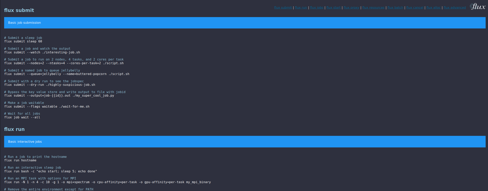

# Flux cheat-sheet

> 🦥️ Show me ALL THE THINGS

Welcome to the Flux cheat-sheet! This is a quick reference for Flux commands,
some basic for learning, and some hard to remember. We also serve these commands
programatically for tools that want to use them.

 - [View the Cheat Sheet](https://flux-framework.org/cheat-sheet/)
 - [View the API](https://flux-framework.org/cheat-sheet/data.json)
 - [feed.json](https://flux-framework.org/cheat-sheet/feed.json)
 
## How to Contribute?

If there is ever a time when you have to ask, or look deeply to figure out how
to do something in Flux, that's the exactly the command of command we want added here!
You can add your command to [_data/flux-commands.yaml](_data/flux-commands.yaml)
under the correct group.

 - The top level refers usually to a single command or topic (e.g., "flux submit")
 - Groups under this can be topic specific, e.g., "Basic examples to submit jobs"
 - Each group has one or more "items" (that you can add to!)
 - As a hack to tell the parser which item is last, we always set `last:true` on the last item.
 
We don't have testing for validation of the content yet (spelling and json validation)
but we will add this soon! It's a fairly simple design, and we hope it looks OK on
mobile too. 

Let us know if you have feedback on any of the additions below.

## Possible Additions

 - a top navigation to jump down to command sections
 - Pinned top navigation to jump to sections
 - testing / CI to validate that data renders to valid json
 - a multiple column page option
 - dark/light mode?
